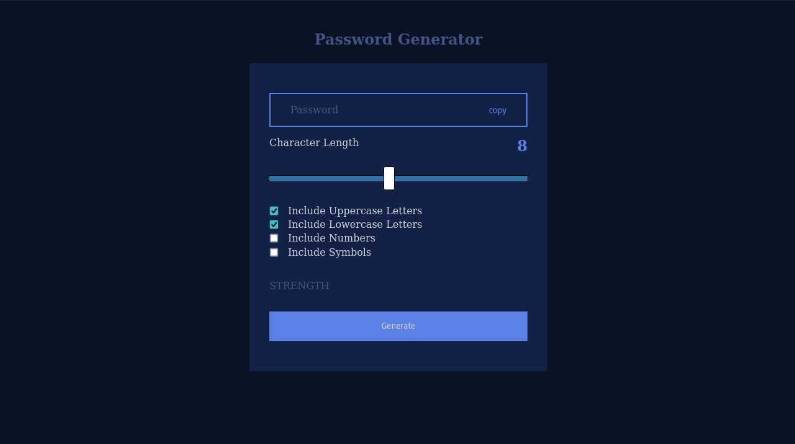
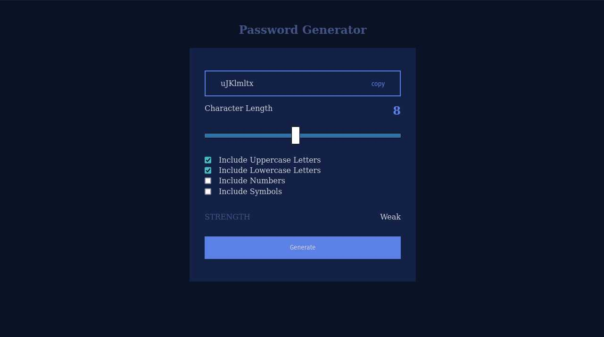
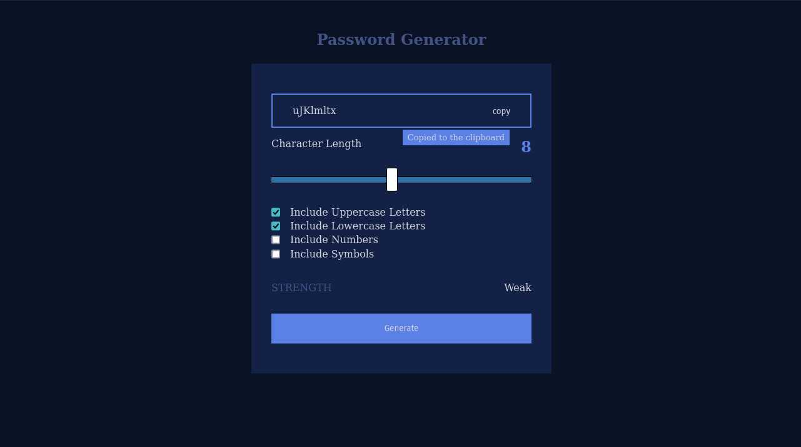
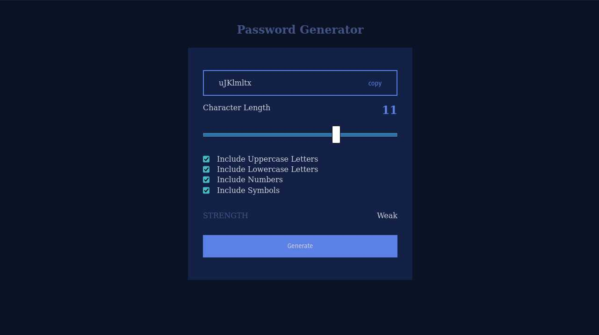
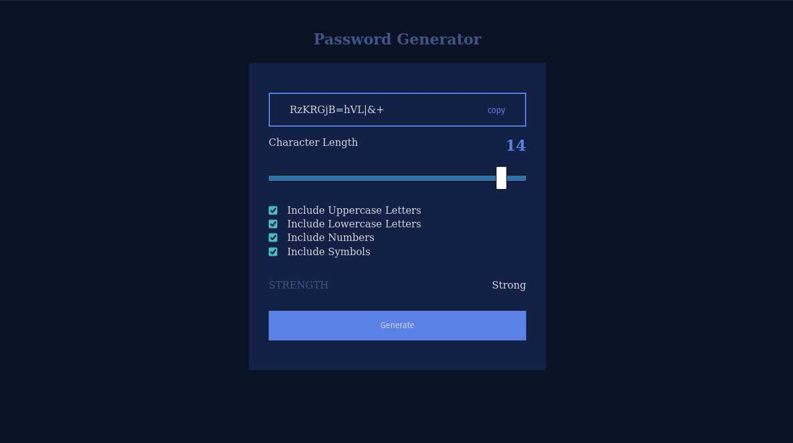

# Random-Password-Generator

Generate your own robust and secure password in no time.

## Features:

- Copy Password to clipboard.
- Select preferred Length of Password.
- Include Numbers and Symbols to make Password strong.
- Feedback about the strength of the generated Password

---

## Preview images:

 

### Starting page:

 

 

- App opens with pre-configured length and characters to include to generate.

 

### Generate:

 

 

- After clicking generate button a new random password will be created. It will be based on Length and Selected characters

 

### Copy To Clipboard:

 

 

- Click 'copy' to copy generated Password to clipboard.
- Copied Password can be pasted anywhere in the device.

 

### Increase-Strength:

 

 

- Increase strength of Password by increasing length.
- Or by including more characters to generated from.

 
 

### Strong:

 

 

- Strength is catagorized in four different levels.
  - Very Weak
  - Weak
  - Medium
  - Strong
- After generating Password tweak options to pick one according to your need.

 
 

---

## Tech Stack Used:

 

  
  

  

---

## Link of deployed app:

TBA

---

## Profiles:
